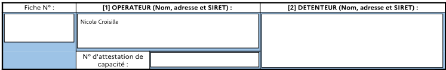
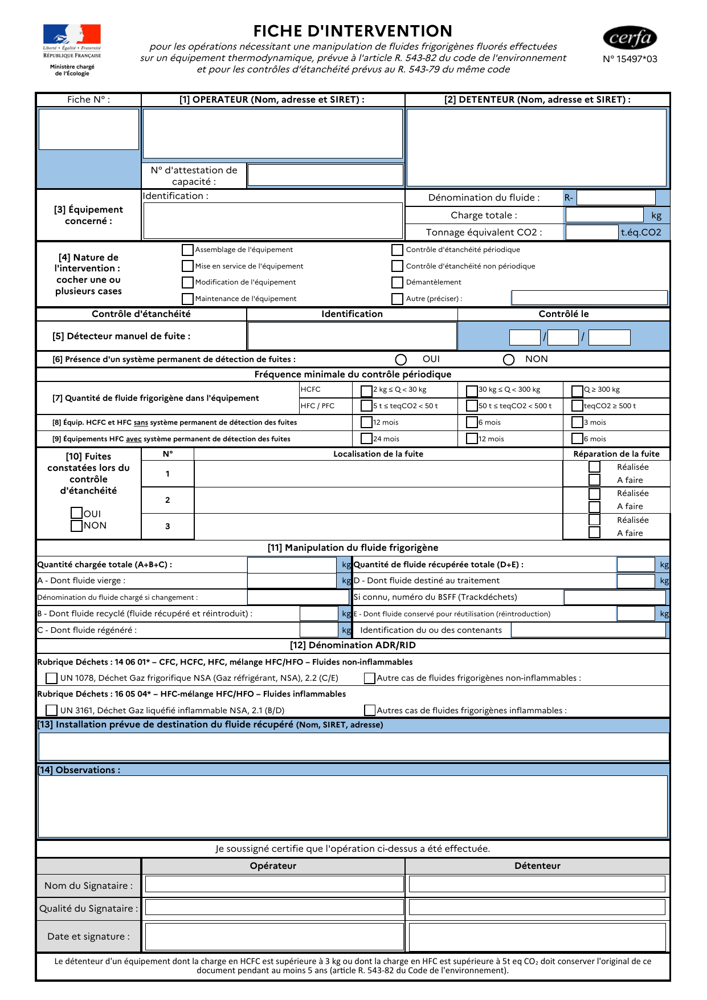
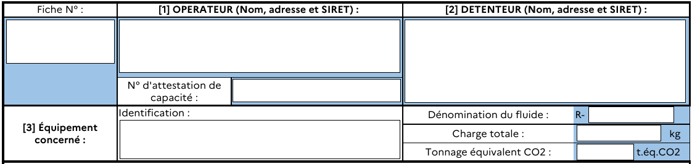
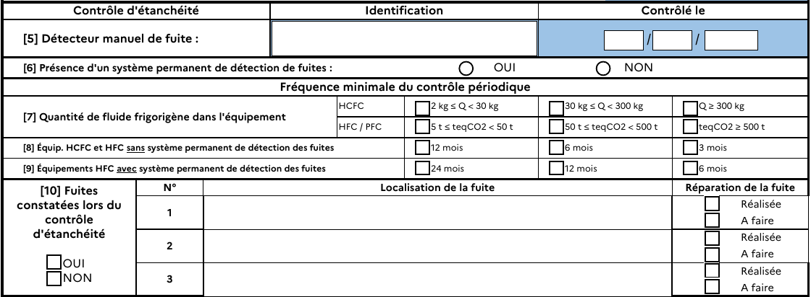
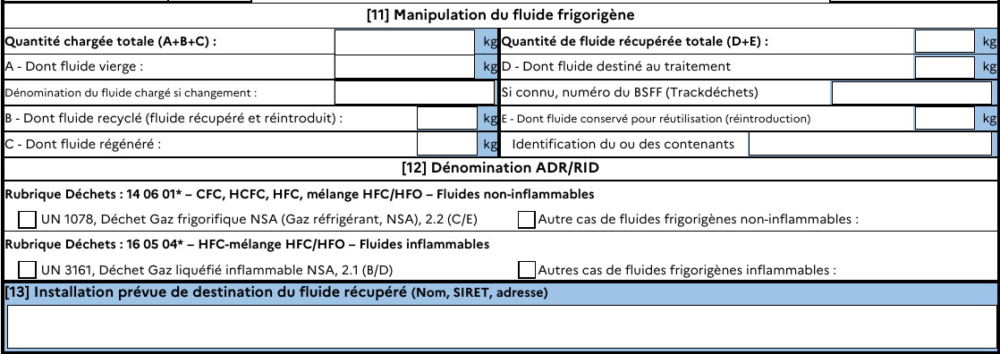
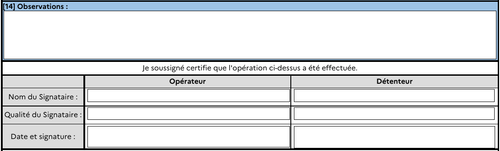
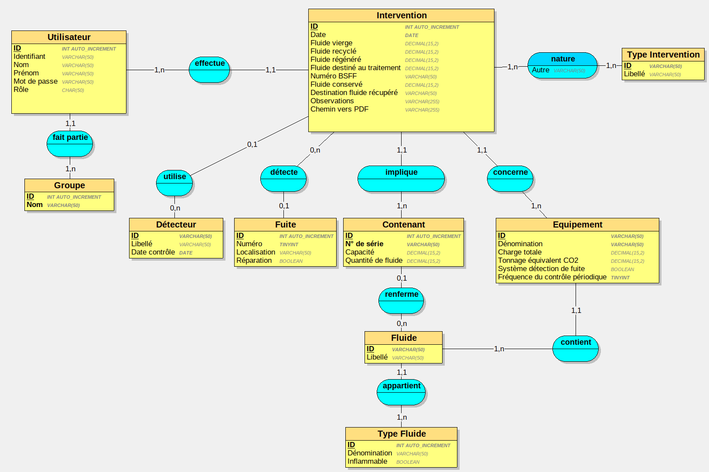

# Gesfluid

Application de gestion de fiches d'intervention concernant des équipements contenant des fluides frigorigènes.

## Projet

Une *intervention* nécessitant une *manipulation de fluide frigorigènes* effectuée sur un *équipement thermodynamique* requiert la complétion d'un *formulaire* émanant du Centre d'enregistrement et de révision des formulaires administratifs (CERFA). Ces formulaires doivent être conservés pendant au moins 5 ans.

La finalité de l'application **Gesfluid** est d'automatiser le remplissage de ce document, dont le gabarit est fourni au format PDF.

## Remplir un fichier PDF existant

Notre choix s'est porté sur le logiciel [PDFtk Server](https://www.pdflabs.com/tools/pdftk-server/) et le wrapper en **PHP** [php-pdftk](https://github.com/mikehaertl/php-pdftk).
**PDFtk** est un utilitaire en ligne de commande qui permet la manipulation de PDF et d'obtenir des informations utiles sur ce type de fichiers.

Dans un premier temps, nous avons besoin de la liste des noms des champs du formulaire. On l'obtient en entrant la commande suivante :

`$ pdftk template.pdf dump_data_fields > fields.txt`

Le fichier  `fields.txt`  contient désormais la liste des champs :

```shell
$ sed 19q fields.txt
---
FieldType: Text
FieldName: Fiche_no
FieldFlags: 4096
FieldValue: 
FieldJustification: Center
---
FieldType: Text
FieldName: Operateur
FieldFlags: 4096
FieldValue: 
FieldJustification: Left
---
FieldType: Text
FieldName: Attestation_no
FieldFlags: 4096
FieldValue: 
FieldJustification: Center
---
$
```

Afin de tester le wrapper **php-pdftk**, écrivons un script PHP qui nous permettra de renseigner le nom de l'operateur.

```php
<?php
require_once '../vendor/autoload.php';

use mikehaertl\pdftk\Pdf;

$pdf = new Pdf();
$pdf->addFile('template.pdf');
$pdf->fillForm([
    'Operateur' => 'Nicole Croisille'
])
  ->saveAs('test_operateur.pdf');
?>
```

Et nous obtenons :



## Le formulaire



On constate que le formulaire est divisé en plusieurs sections :

### Opérateur, détenteur et équipement



### Type d'intervention


### Contrôle d'étanchéité



### Manipulation de fluide frigorigène et déchets



### Observations, date et signatures



À partir de ces différentes sections nous pouvons définir un dictionnaire et un modèle conceptuel de données.

## Dictionnaire de données

| Code                       | Libellé                                                               | Type        | Observations                                                                                        |
| -------------------------- | --------------------------------------------------------------------- | ----------- | --------------------------------------------------------------------------------------------------- |
| **Utilisateur**            | -                                                                     | -           | -                                                                                                   |
| nom                        | Nom de l'opérateur                                                    | Texte       |                                                                                                     |
| prénom                     | Prénom de l'opérateur                                                 | Texte       |                                                                                                     |
| **Équipement**             | -                                                                     | -           | -                                                                                                   |
| libellé                    | Identification de l'équipement                                        | Texte       |                                                                                                     |
| fluide                     | Dénomination du fluide contenu dans l'équipement                      | Texte       |                                                                                                     |
| charge                     | Charge totale de fluide dans l'équipement                             | Numérique   |                                                                                                     |
| tonnage_eq_co2             | Tonnage équivalent CO<sub>2</sub> du fluide contenu dans l'équipement | Numérique   |                                                                                                     |
| système_détection_de_fuite | L'équipement doté d'un système permanent de détection de fuites       | Booléen     |                                                                                                     |
| fréquence_contrôle         | Fréquence minimale du contrôle périodique                             | Numérique   | *24, 12 ou 6 mois dans le cas d'un équipement doté d'un détecteur de fuites, sinon 12, 6 ou 3 mois* |
| **Fluide**                 | -                                                                     | -           | -                                                                                                   |
| libellé                    | Libellé du fluide                                                     | Texte       |                                                                                                     |
| **Type de fluide**         | -                                                                     | -           | -                                                                                                   |
| libellé                    | Description du type de fluide                                         | Texte       |                                                                                                     |
| inflammable                | Le fluide est inflammable                                             | Booléen     |                                                                                                     |
| **Type d'intervention**    | -                                                                     | -           | -                                                                                                   |
| libellé                    | Libellé de la nature de l'intervention                                | Texte       | *Un seul type d'intervention par formulaire*                                                        |
| **Accessoire**             | -                                                                     | -           | -                                                                                                   |
| libellé                    | Identification de l'accessoire                                        | Texte       |                                                                                                     |
| date_contrôle              | Date du dernier contrôle de l'accessoire                              | Date        |                                                                                                     |
| détecteur de fuites        | L'accessoire est un détecteur de fuites                               | Booléen     |                                                                                                     |
| **Fuite**                  | -                                                                     | -           | -                                                                                                   |
| localisation               | Localisation de la fuite                                              | Texte       |                                                                                                     |
| réparation_effectuée       | Réparation de la fuite                                                | Booléen     |                                                                                                     |
| **Intervention**           | -                                                                     | -           | -                                                                                                   |
| autre_type                 | Précisions sur le type d'intervention *Autre*                         | Texte       |                                                                                                     |
| fluide_vierge              | Quantité chargée de fluide vierge                                     | Numérique   |                                                                                                     |
| fluide_recyclé             | Quantité chargée de fluide recyclé                                    | Numérique   |                                                                                                     |
| fluide_régénéré            | Quantité chargée de fluide régénéré                                   | Numérique   |                                                                                                     |
| fluide_pour_traitement     | Quantité récupérée de fluide destiné au traitement                    | Numérique   | *Fluide à recycler*                                                                                 |
| numéro_bsff                | Numéro du bordereau de suivi de fluide frigorigène (BSFF)             | Texte       |                                                                                                     |
| fluide_pour_réutilisation  | Quantité récupérée de fluide réutilisable                             | Numérique   |                                                                                                     |
| lieu_installation          | Installation prévue de destination du fluide récupéré                 | Texte       |                                                                                                     |
| observations               | Observations au sujet de l'intervention                               | Texte       |                                                                                                     |
| date                       | Date de l'intervention                                                | Date        |                                                                                                     |
| **Contenant**              | -                                                                     | -           | -                                                                                                   |
| libellé                    | Identification du contenant                                           | Texte       |                                                                                                     |
| (capacité)                 | (Capacité du contenant)                                               | (Numérique) |                                                                                                     |
| (quantité)                 | (Quantité de fluide dans le contenant)                                | (Numérique) |                                                                                                     |

## Modèle conceptuel de données



## Diagramme de cas d'utilisation

L'application sera utilisée par deux types d'utilisateurs : les stagiaires et les formateurs. Les formateurs feront partie du groupe `ADMIN` et les stagiaires feront partie du groupe de leur session, par exemple : `CDA22075`.

Un administrateur aura tous les droits sauf celui de modifier une intervention. Un stagiaire pourra saisir une nouvelle intervention et consulter les interventions qu'il a effectuées par le passé.


